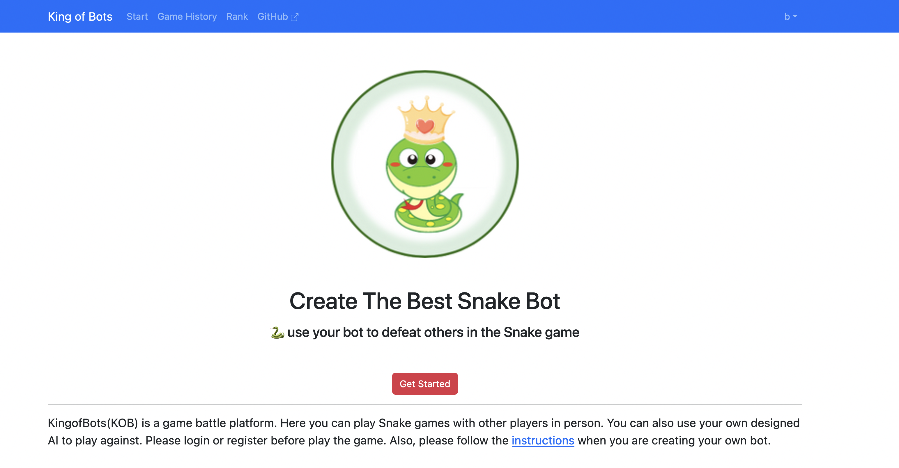
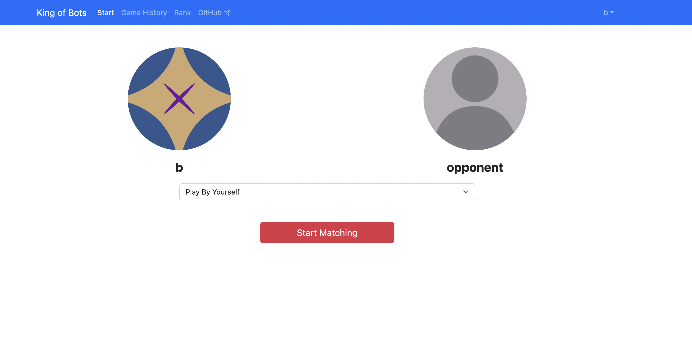
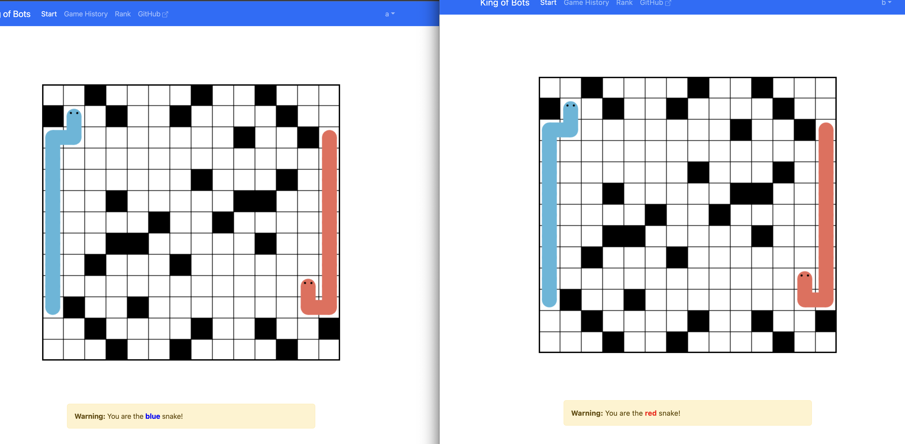
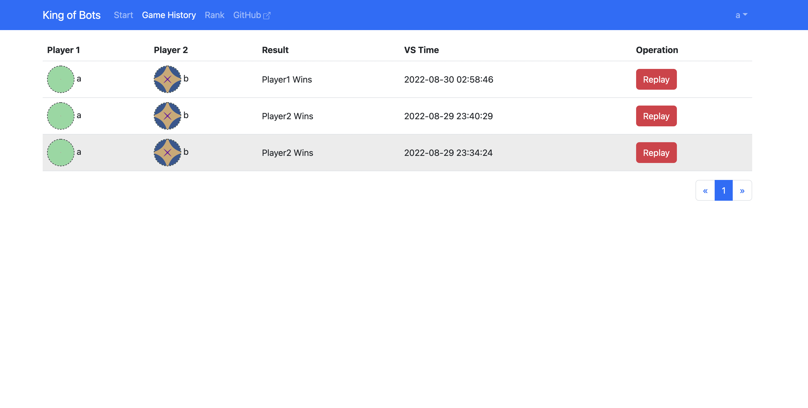
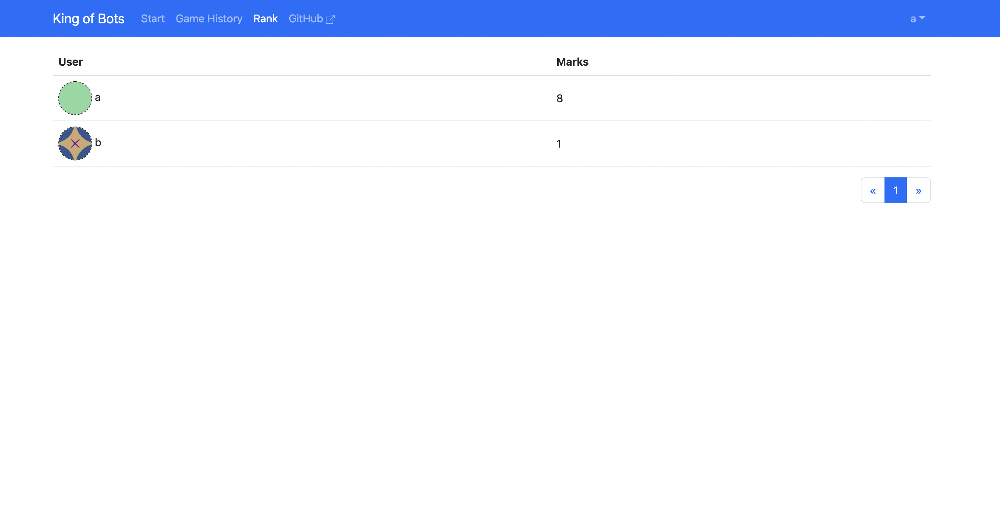
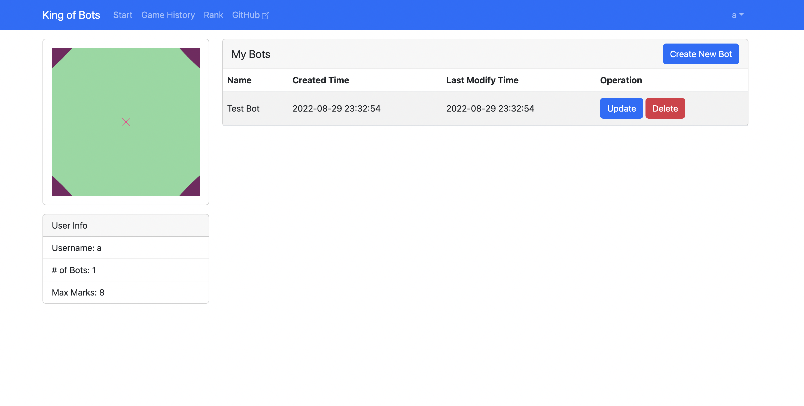
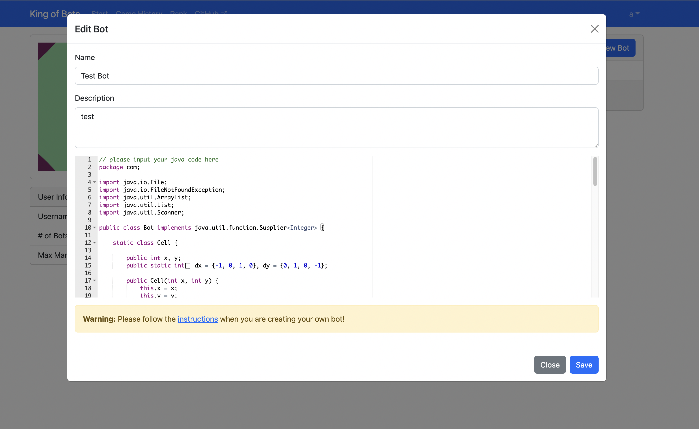

# King of Bots

## Intro

KingofBots(KOB) is a game battle platform. Here you can play Snake games with other players in person. You can also use your own designed AI to play against. You can also watch the history of all games and replay them. There's a rank list that you can check how strong your bot is. In the profile page, you can create and update your bots' code.

Website Demo: https://kingofbots.org/















## Tech Stacks

* Spring Boot
* Java Multithreading
* MySQL
* Vue.js
* Bootstrap
* Docker
* WebSocket

## Bot Creation Instruction

* Now, the editor can only support Java language, so please write your bot file in Java. I consider to support more languages in the future.

* Please include `package com;` at the beginning of the code, since I use [joor](https://github.com/jOOQ/jOOR) dependency to do the reflection, and set the class name as `com.Bot`. Also, please implement `java.util.function.Supplier<Integer>`, and override the `get()` method.

* In each round, the WebSocketServer will send the game map, the start point of player 1 and player2, and their steps which they have taken all in the String format to the BotRunningSystem, and also save in the file `input.txt`. The format is like below:

  `map string#player1 start point x index#player1 start point y index#(player1's steps have taken)#player2 start point x index#player2 start point y index#(player2's steps have taken)`

  so what you need to do is reading the data from `input.txt` and doing some string manipulations in each round to do the best choice for the bot.

* Here is a sample file below:

```java
// please include this
package com;

import java.io.File;
import java.io.FileNotFoundException;
import java.util.ArrayList;
import java.util.List;
import java.util.Scanner;

// please implement java.util.function.Supplier<Integer>
// the return value should be a integer
// 0: up, 1: right, 2: down, 3: left
public class Bot implements java.util.function.Supplier<Integer> {

    static class Cell {

        public int x, y;
        public static int[] dx = {-1, 0, 1, 0}, dy = {0, 1, 0, -1};

        public Cell(int x, int y) {
            this.x = x;
            this.y = y;
        }
    }

    public boolean checkTailInc(int step) {
        return step <= 10 || step % 3 == 1;
    }

    public List<Cell> getCells(int sx, int sy, String steps) {
        steps = steps.substring(1, steps.length() - 1);
        List<Cell> cells = new ArrayList<>();

        int round = 0;
        int x = sx, y = sy;
        cells.add(new Cell(x, y));
        for (int i = 0; i < steps.length(); i++) {
            int d = steps.charAt(i) - '0';
            x += Cell.dx[d];
            y += Cell.dy[d];
            cells.add(new Cell(x, y));
            if (!this.checkTailInc(++round))
                cells.remove(0);
        }

        return cells;
    }

    public Integer nextMove(String input) {
        String[] strings = input.split("#");
        int[][] map = new int[13][14];
        for (int i = 0, k = 0; i < 13; i++) {
            for (int j = 0; j < 14; j++, k++) {
                if (strings[0].charAt(k) == '1') {
                    map[i][j] = 1;
                }
            }
        }

        int aSx = Integer.parseInt(strings[1]), aSy = Integer.parseInt(strings[2]);
        int bSx = Integer.parseInt(strings[4]), bSy = Integer.parseInt(strings[5]);

        List<Cell> aCells = getCells(aSx, aSy, strings[3]);
        List<Cell> bCells = getCells(bSx, bSy, strings[6]);
        for (Cell c : aCells) map[c.x][c.y] = 1;
        for (Cell c : bCells) map[c.x][c.y] = 1;
        for (int i = 0; i < 4; i++) {
            int x = aCells.get(aCells.size() - 1).x + Cell.dx[i];
            int y = aCells.get(aCells.size() - 1).y + Cell.dy[i];
            if (x >= 0 && x < 13 && y >= 0 && y < 14 && map[x][y] == 0)
                return i;
        }

        return 0;
    }
  
  	// the most important! you need to implement this method
    @Override
    public Integer get() {
      	// please read this file first, all the information are saved in this file
        File file = new File("input.txt");
        try {
            Scanner sc = new Scanner(file);
            return nextMove(sc.next());
        } catch (FileNotFoundException e) {
            throw new RuntimeException(e);
        }
    }
}

```


